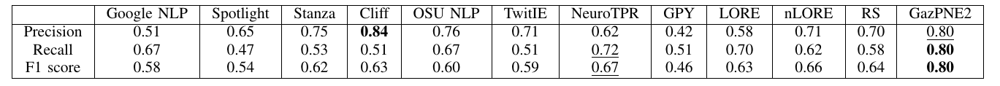

# GazPNE2
## Introduction
We present a robust and general place name extractor for English tweets, GazPNE2,  which fuses deep learning, global gazetteers (e.g., OpenStreetMap), and pretrained transformer models, requiring no manually annotated data. GazPNE2 can extract place names at both coarse (e.g., country and city) and fine-grained (e.g., street and creek) levels and place names with abbreviations (e.g., `tx' for `Texas' and `studemont rd' for `studemont road'). We compare GazPNE2 with 9 competing approaches on 11 public tweet data sets, containing 21,393 tweets and 16,790 place names across the world.
## Code
The code and data will be available soon
## Result

