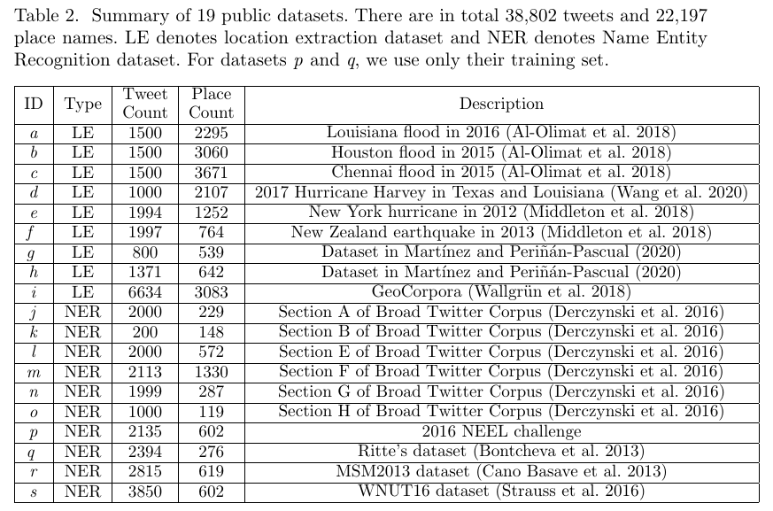
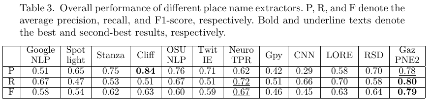

# GazPNE2
## Introduction

We present  a robust and general place name extraction method from tweet texts, named GazPNE2. It fuses deep learning, global gazetteers (i.e., OpenStreetMap and GeoNames), and pretrained transformer models (i.e., BERT and BERTweet), requiring no manually annotated data. It can extract place names at both coarse (e.g., country and city) and fine-grained (e.g., street and creek) levels and place names with abbreviations (e.g., ‘tx’ for ‘Texas’ and ‘studemont rd’ for ‘studemont road’). 

## Test Data
The data we used to evaluate our approach is as follows:

## Result

## Use the code
### Prepare model data
Download the trained [model](https://drive.google.com/file/d/1vN0dGBS2JvyKjaZ6eb-u_o6Veq5p9uFv/view?usp=sharin) and unzip the files into the _model_ folder.

Download the [prior probability dictionary](https://drive.google.com/file/d/1jQ29fWNQP48nUUoU_Cwx67MffUjDTf1c/view?usp=sharing) and put it in the _data_ folder.

### Install python dependencies
Python 3.7 is required

> pip install -r requirements.txt

### Download pretrained BERTweet model
> wget https://public.vinai.io/BERTweet_base_fairseq.tar.gz

> tar -xzvf BERTweet_base_fairseq.tar.gz

In the first run, the pretrained BERT models will be automaticlly downloaded and cached on the local drive.

### Use the code

> from main import GazPNE2
> 
> gazpne2=GazPNE2()
> 
> tweets = ['Associates at the Kuykendahl Rd & Louetta Rd . store in Spring , TX gave our customers a reason to smile (: tayytink )','Rockport TX any photos of damage down Corpus Christi Street and Hwy 35 area ? Harve ']
> 
> entities = gazpne2.extract_location(tweets)

Note that it might take around 1 minute to load required models and data. 

Test your own data: Set <*input*> to 0 and set <*input_file*> to the path of your data. It is a .txt file with each line corresponding to a tweet message.

> python -u main.py --input=0 --input_file=data/test.txt

Test our manually annotated data (3000 tweets): Set <*input*> to 2.

Test public datasets: Set <*input*> to 4, then you will get the result of partial datasets since some are not publicly available and should be requested from the authors of the data.
datasets [a,b,c]  can be obtained from https://rebrand.ly/LocationsDataset.
datasets [e,f] can be obtained from https://revealproject.eu/geoparse-benchmark-open-dataset/.
datasets [g,h] can be obtained by contacting the [author](https://www.researchgate.net/publication/342550989_Knowledge-based_rules_for_the_extraction_of_complex_fine-grained_locative_references_from_tweets) of the data.

To execute below command in case of a jave error.  

> spack load openjdk

